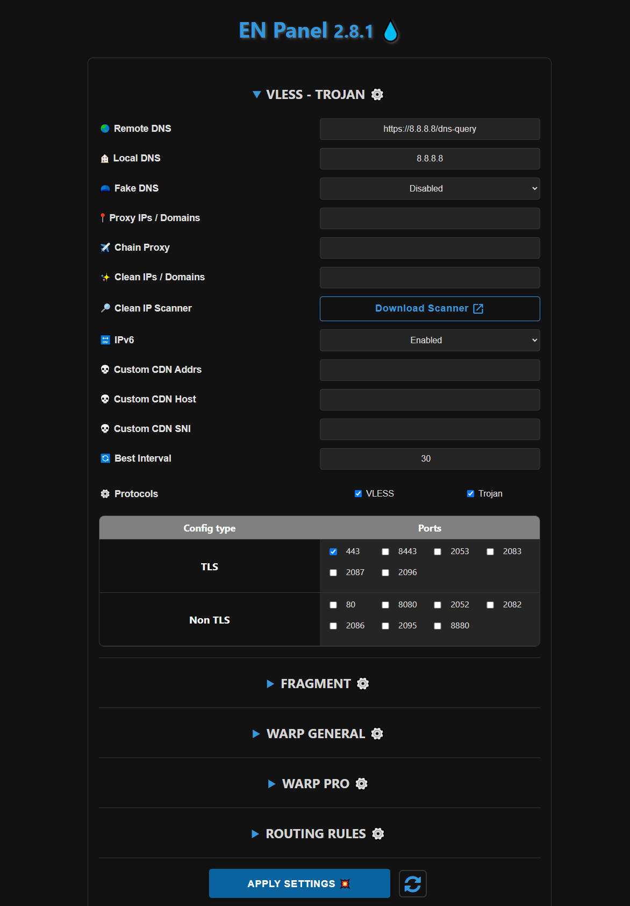
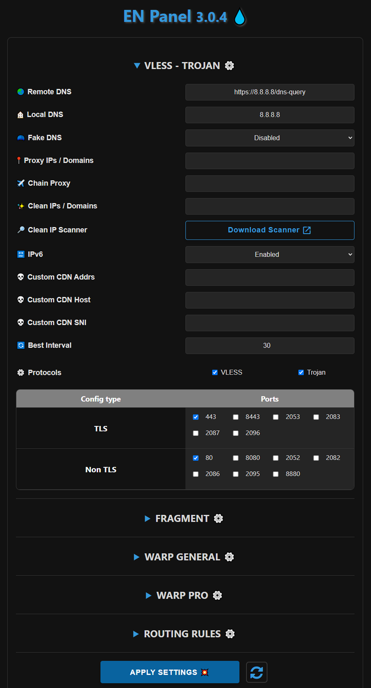
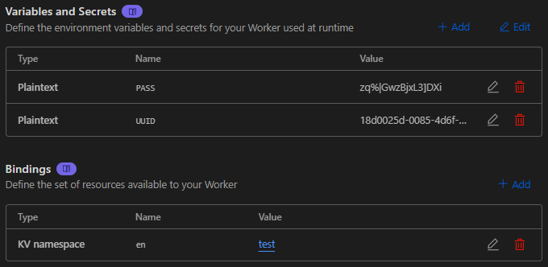

<h1 align="center">💧 BPB-Panel EN 💧</h1>

  

 

## ⭐ تغییرات نسخه BPB-Panel EN

- رفع ارور 1101
- کلمه BPB از ورکر حذف شد و با کلمه EN جایگزین شد
- ایموجی 💦 به طور کامل از ورکر حذف شد و با ایموجی 💧 جایگزین شد
- در بخش kv قسمت Variable name کلمه bpb با en جایگزین شده است.
- در بخش Variables and Secrets ، کلمه TROJAN_PASS با PASS جایگزین شده است (TROJAN_PASS = PASS)
- در داخل کد های ورکر تمامی دستورات VLESS و Trojan با CVLee و CTLee جایگزین شده اند (CVLee = VLESS - CTLee = Trojan)

**این ورکر توسط obfuscator.io مبهم سازی شده!**
 

 

## 📥 نحوه نصب BPB-Panel EN
- اول از همه ورکر را از قسمت [Releases](https://github.com/iErfun/BPB-Panel-EN/releases/latest) دانلود کنید.
- برای ورکر فایل worker.js را دانلود کنید ، برای پیجز فایل worker.zip
- در cloudflare بخش Worker & Pages بروید و یک Worker یا Pages جدید بسازید.
- بعد ورکر را آپلود کنید.
- بعد به بخش settings بروید و طبق تصویر زیر تنظیمات را روی ورکر خود اعمال کنید.

  

  

## 📜 توضیحات
- پنل BPB اصلی : https://github.com/bia-pain-bache/BPB-Worker-Panel
- مرسی از [Tead65](https://github.com/Tead65)
- این پروژه فعلا برای رفع مشکل 1101 درحال فعالیت هستش ، اگر نسخه اصلی BPB Panel این مشکل را برطرف کند ، این پروژه برای همیشه متوقف خواهد شد

 
