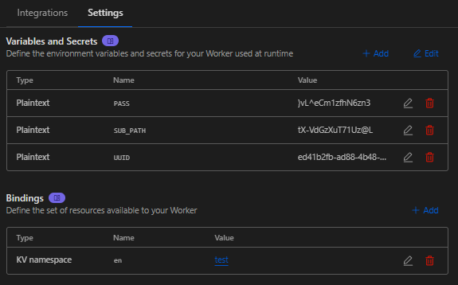

<h1 align="center">💧 BPB-Panel EN 💧</h1>

  

 

## ⭐ تغییرات نسخه BPB-Panel EN

- رفع ارور 1101
- کلمه BPB از ورکر حذف شده و کلمه EN جایگزین شده
- ایموجی 💦 به طور کامل از ورکر حذف شده و ایموجی 💧 جایگزین شده
- در بخش kv قسمت Variable name کلمه bpb به en جایگزین شده
- در بخش Variables and Secrets ، کلمه TROJAN_PASS به PASS جایگزین شده
- در داخل کد های ورکر تمامی دستورات VLESS و Trojan به CVLee و CTRee جایگزین شدن

**این ورکر توسط obfuscator.io مبهم سازی شده!**
 
 

## 📥 نحوه نصب BPB-Panel EN
- اول از همه ورکر را از قسمت [Releases](https://github.com/iErfun/BPB-Panel-EN/releases/latest) دانلود کنید
- برای ورکر فایل worker.js و برای پیجز فایل worker.zip را دانلود کنید
- همچنین شما میتونید از نسخه مبهم سازی نشده ورکر هم استفاده کنید که با unobfs-worker نام گذاری شده
- در کلادفلر بخش Worker & Pages بروید و یک Worker یا Pages جدید بسازید
- سپس ورکر را آپلود کنید
- بعد به بخش settings بروید و طبق تصویر زیر تنظیمات را روی ورکر خود اعمال کنید.

**[اموزش نصب پنل در Pages کلودفلر](https://github.com/iErfun/BPB-Panel-EN/blob/main/README_PAGES.md)**

  

## 📜 توضیحات
- پنل BPB اصلی : https://github.com/bia-pain-bache/BPB-Worker-Panel
- این پروژه به دلیل درخواست بالا بروزرسانی شد
- پنل اصلی یعنی bpb مشکل ارور 1101 کلادفلر را برطرف کرده و دیگه نیازی به این پروژه نداریم ولی چون واسه بعضی از کاربر ها این پنل مشکلات کمتری نسبت به پنل bpb داشته واسه همین این پروژه به طور کل متوقف نمیشه

 
