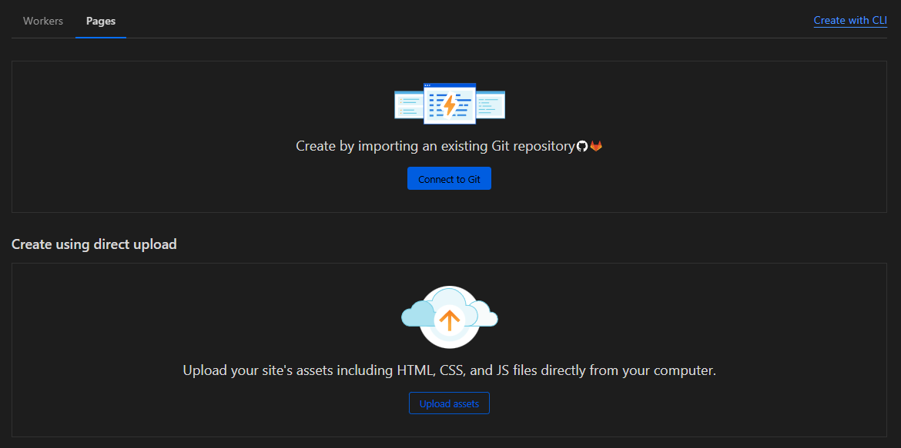
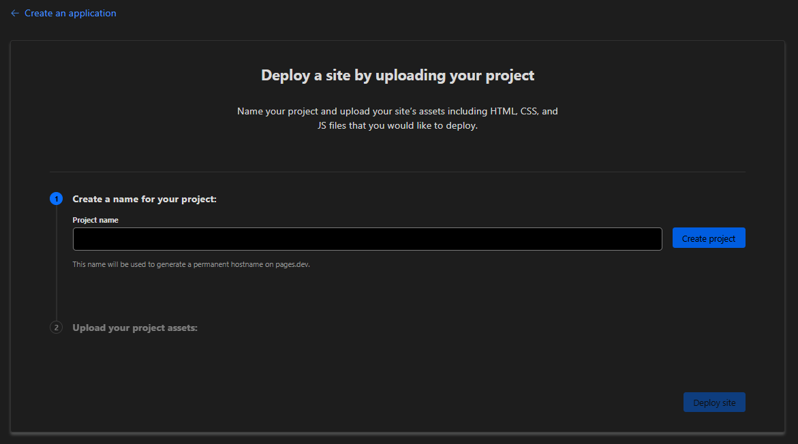
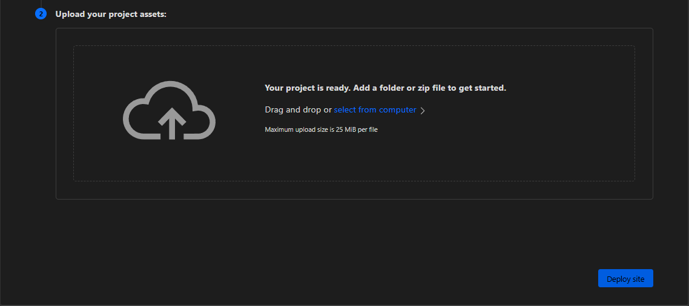
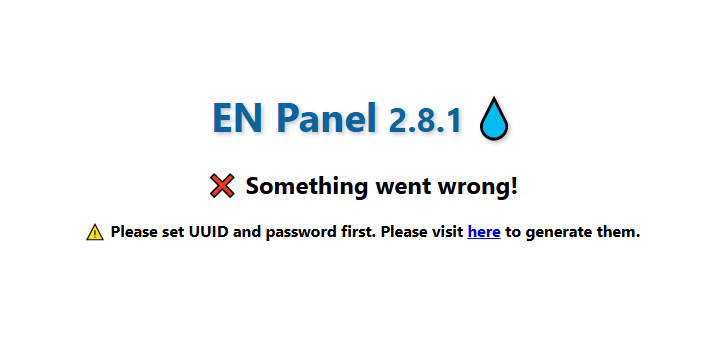
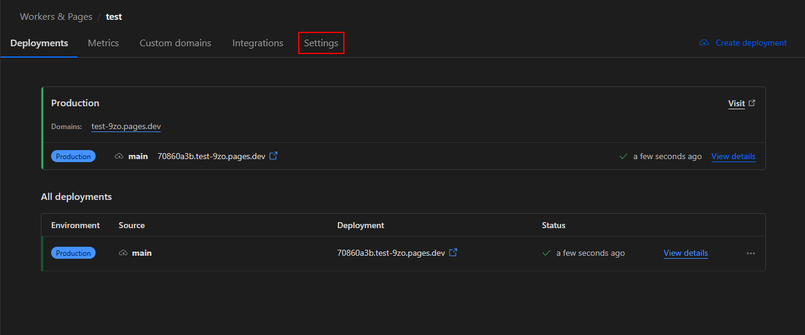
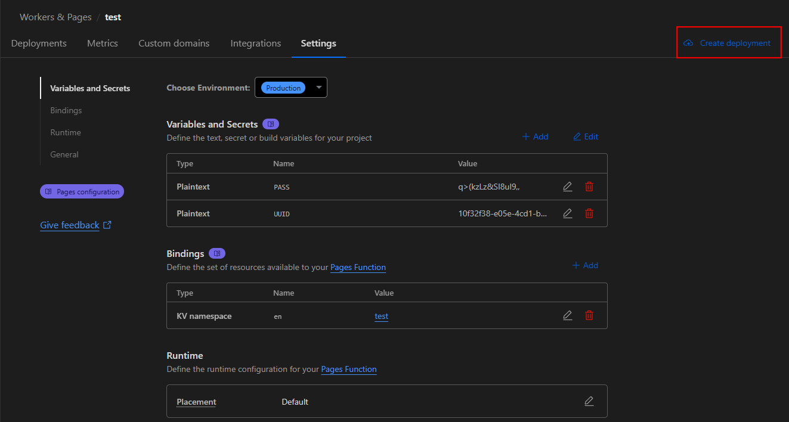
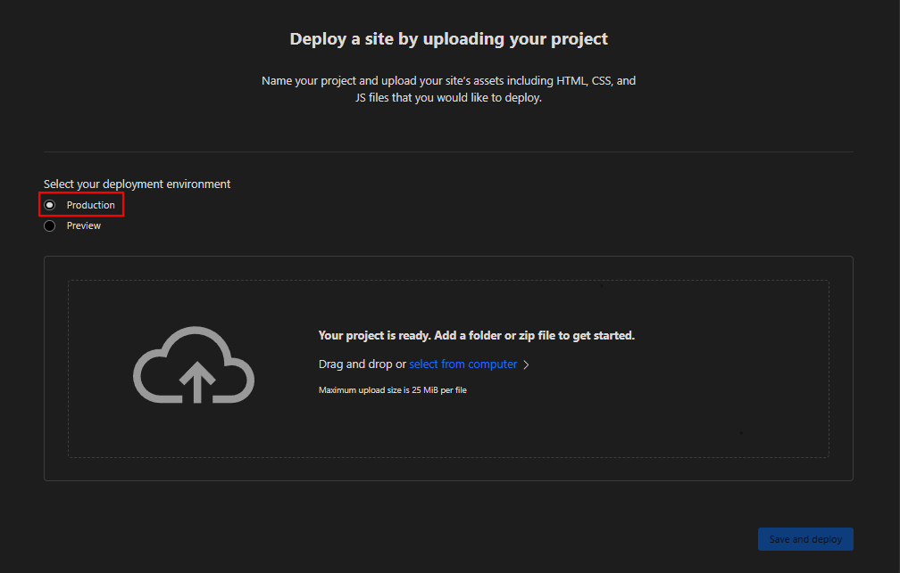
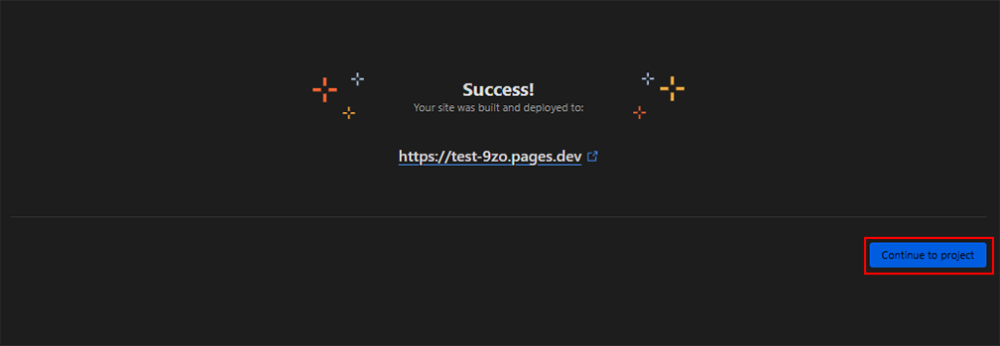
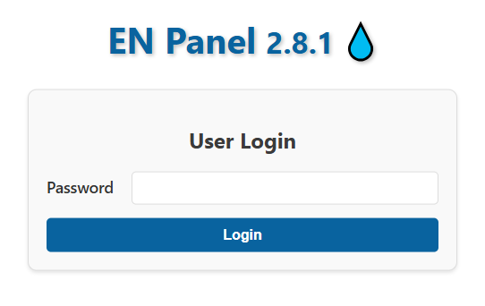

<h1 align="center">💧 آموزش نصب پنل در Pages کلودفلر 💧</h1>
 

برای نصب پنل ابتدا باید فایل [worker.zip](https://github.com/iErfun/BPB-Panel-EN/releases/latest) را دانلود کنید.

سپس وارد سایت کلودفلر شوید و از بخش Workers & Pages روی گزینه Create بزنید و از قسمت بالا سمت چپ روی گزینه Pages بزنید و یک Pages جدید بسازید.

اگر فایل worker.zip رو دانلود کردید باید روی گزینه دومی بزنید.

  

در مرحله بعد ، شما باید یک اسم برای پیجز خود انتخاب کنید و روی گزینه Create Project بزنید.

در مرحله بعدی شما باید فایل worker.zip رو در آپلود کنید.

و بعد از آپلود روی گزینه Deploy Site بزنید تا پیجز شما ساخته بشه.

  

  

بعد از انجام تمامی کار ها پیجز شما ساخته شد!

در این مرحله شما باید تمامی کار هایی که قبلا روی worker معمولی انجام می دادید رو بدید مثل تنظیم UUID ، PASS و KV.

برای دریافت UUID و PASS باید روی گزینه Visit بزنید تا وارد صفحه BPB-Panel EN شوید.

بعد روی گزینه here تو همون صفحه BPB بزنید تا وارد بخش UUID و PASSWORD شوید.

بعد برید تو قسمت Settings و تمامی تنظیمات مورد نیاز رو اعمال کنید.

  

  

  

اگر شما بعد از وارد کردن تمامی تنظیمات مورد نیاز باز با صفحه ارور مواجه شدید ، شما باید روی گزینه Create Deployment بزنید تا فایل worker.zip رو دوباره آپلود کنید تا این مشکل حل شود.

دقت کنید که هنگام آپلود مجدد فایل ورکر باید تو همون قسمت بخش Select your deployment environment باید روی گزینه Production باشه

  

  

  

و در اخر روی گزینه Visit بزنید تا وارد صفحه لاگین BPB شوید

  

**[بازگشت به صفحه اصلی](https://github.com/iErfun/BPB-Panel-EN)**
 
